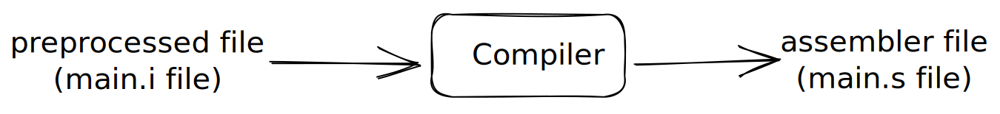

# How Each GCC Process C/C++ Code

```c
// main.s file 

#include <stdio.h>

int main() {
    printf("Hello world");
    return 0;
}
```

## Preprocessing (Preprocessor)



`gcc main.c -o main.i # preprocess file using gcc`

```c
// output: main.i
...
...
... include directive
...
...
# 52 "/Applications/Xcode.app/Contents/Developer/Platforms/MacOSX.platform/Developer/SDKs/MacOSX.sdk/usr/include/secure/_stdio.h" 3 4
extern int __snprintf_chk (char * restrict, size_t, int, size_t,
      const char * restrict, ...);
      
extern int __vsprintf_chk (char * restrict, int, size_t,
      const char * restrict, va_list);

extern int __vsnprintf_chk (char * restrict, size_t, int, size_t,
       const char * restrict, va_list);
# 417 "/Applications/Xcode.app/Contents/Developer/Platforms/MacOSX.platform/Developer/SDKs/MacOSX.sdk/usr/include/stdio.h" 2 3 4
# 2 "main.c" 2

int main() {
    printf("Hello world");
    return 0;
}
```

## Compiling (Compiler)


```nasm
// output: main.s

	.section	__TEXT,__text,regular,pure_instructions
	.build_version macos, 13, 0	sdk_version 13, 3
	.globl	_main                           ; -- Begin function main
	.p2align	2
_main:                                  ; @main
	.cfi_startproc
; %bb.0:
	sub	sp, sp, #32
	.cfi_def_cfa_offset 32
	stp	x29, x30, [sp, #16]             ; 16-byte Folded Spill
	add	x29, sp, #16
	.cfi_def_cfa w29, 16
	.cfi_offset w30, -8
	.cfi_offset w29, -16
	mov	w8, #0
	str	w8, [sp, #8]                    ; 4-byte Folded Spill
	stur	wzr, [x29, #-4]
	adrp	x0, l_.str@PAGE
	add	x0, x0, l_.str@PAGEOFF
	bl	_printf
	ldr	w0, [sp, #8]                    ; 4-byte Folded Reload
	ldp	x29, x30, [sp, #16]             ; 16-byte Folded Reload
	add	sp, sp, #32
	ret
	.cfi_endproc
                                        ; -- End function
	.section	__TEXT,__cstring,cstring_literals
l_.str:                                 ; @.str
	.asciz	"Hello world"

.subsections_via_symbols
```

## Assembling (Assembler)


The output of assembling process (object file) is already a byte, so it's not human readable, but you can reverse the operation of object file back to assembler code by doing this:


## Linking (Linker)


## Loading (Loader)
